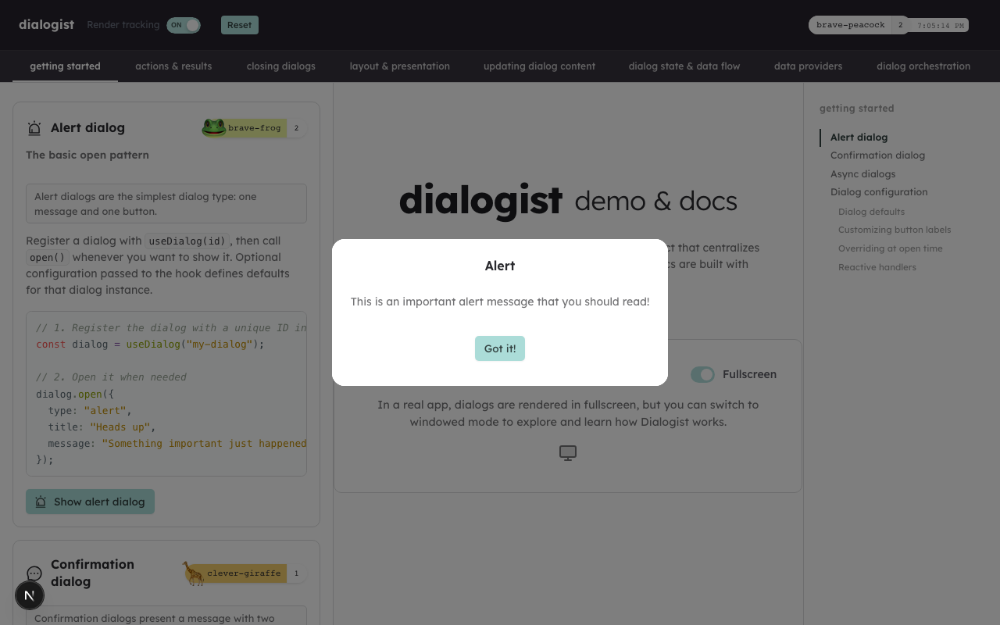
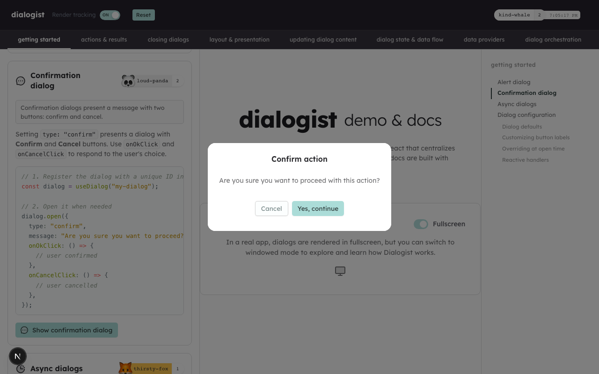

<h1 align="center">
  
  &nbsp;dialogist
</h1>

<p align="center"><strong>Centralized, promise-based dialogs for React.</strong></p>

<p align="center">
  <a href="https://www.npmjs.com/package/dialogist" target="_blank" rel="noopener noreferrer">npm</a>
  ·
  <a href="https://brandonscript.github.io/dialogist/" target="_blank" rel="noopener noreferrer">Documentation</a>
  ·
  <a href="https://github.com/brandonscript/dialogist" target="_blank" rel="noopener noreferrer">GitHub</a>
  ·
  <a href="https://github.com/brandonscript/dialogist/issues" target="_blank" rel="noopener noreferrer">Issues</a>
  ·
  <a href="./LICENSE" target="_blank" rel="noopener noreferrer">License</a>
</p>

## What is Dialogist?

Dialogist is a **centralized dialog manager** for React apps: one provider, hooks from anywhere, no prop drilling. It's built with a style/component-agnostic core, ships first-class adapters for several popular UI libraries, and uses slot-based updates so titles, content, actions, and the dialog backplane can refresh independently without re-rendering the entire component tree.

### Choose your UI library

The same dialog logic can render through whichever UI library you're already using. Pick one — or none, and use the headless DOM defaults — and `import` its adapter under a subpath:

| Adapter        | Import                                               | Peer dependencies                                              |
| -------------- | ---------------------------------------------------- | -------------------------------------------------------------- |
| Headless DOM   | _(default — no import needed)_                       | None beyond `react`/`react-dom`                                |
| MUI            | `import { muiSlots } from "dialogist/mui"`           | `@mui/material` ^7, `@emotion/react`, `@emotion/styled`        |
| Base UI        | `import { baseUiSlots } from "dialogist/base-ui"`    | `@base-ui-components/react` ^1.0.0-rc.0                        |
| shadcn         | `import { shadcnSlots } from "dialogist/shadcn"`     | `@base-ui-components/react`, `tailwindcss` + `tailwindcss-animate` |
| Tailwind       | `import { tailwindSlots } from "dialogist/tailwind"` | `tailwindcss` (with the included preset)                       |

All peer dependencies are **optional** — you only install the libraries for the adapter(s) you actually use. See the [Adapters guide](./docs/adapters.md) for setup snippets and migration notes per adapter.

## Screenshots





## Features

- One `DialogProvider`, dialogs opened from any component
- Synchronous and Promise-based `open()` for async flows
- Slot registry and hooks for state-reactive re-rendering
- Dialog keys to uniquely identify and track dialog instances
- Conflict policies to handle overlapping opens
- TypeScript-first API

## Install

```bash
npm install dialogist
```

**Package version:** 1.0.0

Required peer dependencies: `react` `>=18.0.0` and `react-dom` `>=18.0.0`.

All UI-library peers (`@mui/material`, `@emotion/react`, `@emotion/styled`, `@base-ui-components/react`, `tailwindcss`) are **optional** — install only the ones for the adapter you choose. See [Adapters](./docs/adapters.md) for per-adapter setup.

## Quick start

```tsx
import { DialogProvider, useDialog } from "dialogist";

function App() {
  return (
    <DialogProvider>
      <MyComponent />
    </DialogProvider>
  );
}

function MyComponent() {
  const dialog = useDialog("delete-item");

  const handleDelete = async () => {
    const event = await dialog.open({
      type: "confirm",
      title: "Delete item",
      message: "This action cannot be undone.",
      okLabel: "Delete",
      cancelLabel: "Cancel",
    });

    if (event.ok) {
      // Confirmed
    }
  };

  return <button onClick={handleDelete}>Delete item</button>;
}
```

## Demo and documentation

**Documentation** and a comprehensive set of examples for Dialogist is at <a href="https://brandonscript.github.io/dialogist/" target="_blank" rel="noopener noreferrer">https://brandonscript.github.io/dialogist/</a> — it is the best place to explore Dialogist interactively.

### Run the demo locally

The demo is a Next.js app in <a href="./demo/nextjs" target="_blank" rel="noopener noreferrer"><code>demo/nextjs</code></a>, and can also be run locally. From the repository root:

```bash
npm install
cd demo/nextjs && npm install && cd ../..
npm run demo:nextjs
```

Open <a href="http://localhost:5607" target="_blank" rel="noopener noreferrer">http://localhost:5607</a> in your browser. The `demo:nextjs` script starts the Next.js dev server for `demo/nextjs` on port **5607** by default.

## Contributing

Human contributors: see <a href="./AGENTS.md" target="_blank" rel="noopener noreferrer"><code>AGENTS.md</code></a> for project conventions, testing, and layout rules. While primarily written with LLMs in mind, it's good for humans too.

Issues and pull requests are welcome. For larger changes, open an issue first so we can align on direction. Please run all tests (add/update tests to ensure coverage of your changes) and update the demo app if applicable. All code accepted to main must be reviewed by you, the human.

If you contribute to this project, you agree to adhere to the

## Publishing (maintainers)

1. **Bump the version** (updates root `package.json`, `package-lock.json`, and the **Package version** line in this readme):

   ```bash
   ./scripts/version.sh X.Y.Z
   ```

2. **Sanity-check** tests, types, and what would be published:

   ```bash
   npm test
   npm run typecheck
   npm run release:dry-run
   ```

   Extra `npm publish` flags go after `--`, for example `npm run release -- --dry-run --tag beta`.

   Avoid naming an npm script `publish`: `npm publish` runs the package **publish** lifecycle and would recurse into that script.

3. **Publish** when logged into npm with permission to publish `dialogist`:

   ```bash
   npm run release
   ```

4. **Tag and release on GitHub** (after the version bump is on `main`):

   ```bash
   git tag -a vX.Y.Z -m "vX.Y.Z"
   git push origin main --follow-tags
   gh release create vX.Y.Z --title "vX.Y.Z" --generate-notes
   ```

## Fair AI and LLM usage

AI contributors: see <a href="./AGENTS.md" target="_blank" rel="noopener noreferrer"><code>AGENTS.md</code></a> for project conventions, testing, and layout rules.

If you use AI tools with this codebase or its documentation: do not submit generated changes without **reviewing** them yourself by hand for correctness, security, and fit with project conventions.

## License

<a href="./LICENSE" target="_blank" rel="noopener noreferrer">MIT</a>

## Ethical use

Per the <a href="https://firstdonoharm.dev/" target="_blank" rel="noopener noreferrer">Hippocratic License 3.0</a>, you may not use, copy, modify, or employ this project's source code to cause harm or in any way violate internationally recognized human rights.
